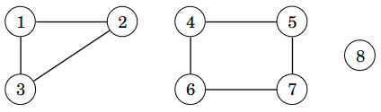
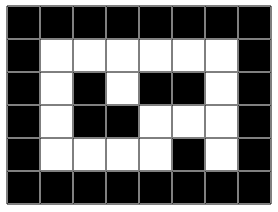

# 8. Verkkoalgoritmit

_Verkko_ (_graph_) on tietorakenne, joka muodostuu _solmuista_ (_node_) ja _kaarista_ (_edge_). Jokainen verkon kaari yhdistää kaksi solmua toisiinsa.

Esimerkiksi seuraavassa verkossa on viisi solmua ja seitsemän kaarta:


Solmun _naapuri_ (_neighbor_) on toinen solmu, johon siitä pääsee kaarella. Esimerkiksi solmun 1 naapurit ovat solmut 2, 3 ja 4. Solmun _aste_ (_degree_) on naapurien määrä. Esimerkiksi solmun 1 aste on 3, koska sillä on 3 naapuria.

Kahden solmun välinen _polku_ (_path_) on kaaria pitkin kulkeva reitti. Tässä on joitakin mahdollisia polkuja solmusta 1 solmuun 5:

* 1 → 2 → 5
* 1 → 4 → 5
* 1 → 3 → 4 → 5
* 1 → 3 → 4 → 2 → 5

Esimerkkejä verkkojen käyttötarkoituksista:

* Tieverkko: Solmut ovat kaupunkeja ja kaaret ovat teitä. Kahden solmun välinen polku vastaa kahden kaupungin välistä reittiä.
* Kontaktiverkko: Solmut ovat ihmisiä ja kaaret ovat kontakteja. Kahden solmun välinen polku kuvaa, mitä kautta ihmiset tuntevat toisensa.
* Tietoverkko: Solmut ovat tietokoneita ja kaaret ovat yhteyksiä. Kahden solmun välinen polku kuvaa, mitä kautta voidaan välittää tietoa.

## Verkot ohjelmoinnissa

Tavallinen tapa käsitellä verkkoa ohjelmoinnissa on pitää muistissa kunkin solmun _vieruslistaa_ (_adjacency list_). Solmun $$x$$ vieruslista sisältää kaikki solmut, joihin pääsee kaarella solmusta $$x$$.

Pythonissa voimme tallentaa verkon sanakirjana, jossa avaimet ovat solmuja ja arvot vieruslistoja. Esimerkkiverkko voidaan tallentaa seuraavasti:

```python
graph = {
    1: [2, 3, 4],
    2: [1, 4, 5],
    3: [1, 4],
    4: [1, 2, 3, 5],
    5: [2, 4]
}
```

Usein on kätevää määritellä verkkoa varten luokka, jossa on metodi kaarien lisäämiseen. Luokka voidaan toteuttaa seuraavasti:

```python
class Graph:
    def __init__(self, nodes):
        self.nodes = nodes
        self.graph = {node: [] for node in nodes}

    def add_edge(self, a, b):
        self.graph[a].append(b)
        self.graph[b].append(a)
```

Tässä konstruktorille annetaan lista `nodes`, jossa on verkon solmut. Tämän perusteella luodaan sanakirja `graph`, joka sisältää vieruslistat. Aluksi jokainen vieruslista on tyhjä, ja metodi `add_edge` lisää kaaren solmujen `a` ja `b` välille.

Nyt voimme luoda esimerkkiverkon näin:

```python
g = Graph([1, 2, 3, 4, 5])

g.add_edge(1, 2)
g.add_edge(1, 3)
g.add_edge(1, 4)
g.add_edge(2, 4)
g.add_edge(2, 5)
g.add_edge(3, 4)
g.add_edge(4, 5)
```

## Syvyyshaku

_Syvyyshaku_ (_depth-first search_) eli _DFS_ on menetelmä, jonka avulla voidaan käydä läpi kaikki verkon solmut, joihin pääsee lähtösolmusta kaaria pitkin. Syvyyshaku voidaan toteuttaa rekursiivisesti verkon vieruslistojen avulla.

Seuraava koodi toteuttaa syvyyshaun:

```python
class DFS:
    def __init__(self, nodes):
        self.nodes = nodes
        self.graph = {node: [] for node in nodes}

    def add_edge(self, a, b):
        self.graph[a].append(b)
        self.graph[b].append(a)

    def visit(self, node):
        if node in self.visited:
            return
        self.visited.add(node)

        for next_node in self.graph[node]:
            self.visit(next_node)

    def search(self, start_node):
        self.visited = set()
        self.visit(start_node)
        return self.visited
```

Metodi `search` suorittaa syvyyshaun solmusta `start_node` alkaen ja palauttaa haun löytämät solmut. Metodi luo ensin joukon `visited`, johon merkitään, missä solmuissa haku on käynyt. Tämän jälkeen metodi kutsuu rekursiivista metodia `visit`, joka toteuttaa haun.

Metodi `visit` saa parametriksi vierailtavan solmun `node`. Jos haku on käynyt solmussa, metodin suoritus päättyy, ja muuten solmu lisätään joukkoon `visited`. Tämän jälkeen metodi käy läpi solmun `node` vieruslistan ja kutsuu itseään rekursiivisesti jokaiselle solmun `node` naapurille.

Seuraava koodi esittelee syvyyshaun toimintaa:

```python
d = DFS([1, 2, 3, 4, 5])

d.add_edge(1, 2)
d.add_edge(1, 3)
d.add_edge(1, 4)
d.add_edge(2, 4)
d.add_edge(2, 5)
d.add_edge(3, 4)
d.add_edge(4, 5)

print(d.search(1))
```

Koodin tulostus on seuraava:

```python
{1, 2, 3, 4, 5}
```

Tämä tarkoittaa, että solmusta 1 pääsee solmuihin 1, 2, 3, 4 ja 5 eli solmusta 1 pääsee kulkemaan kaikkiin verkon solmuihin.

## Komponentit ja yhtenäisyys

Verkon _komponentti_ (_component_) sisältää solmut, jotka ovat yhteydessä toisiinsa kaaria pitkin. Esimerkiksi seuraavassa verkossa on kolme komponenttia: $$\{1,2,3\}$$, $$\{4,5,6,7\}$$ ja $$\{8\}$$.



Verkko on _yhtenäinen_ (_connected_), jos siinä on tasan yksi komponentti eli minkä tahansa kahden solmun välillä on reitti kaaria pitkin. Esimerkiksi seuraava verkko on yhtenäinen, koska sen ainoa komponentti on $$\{1,2,3,4,5\}$$.


Esimerkiksi tieverkossa komponentti sisältää kaupungit, joiden välillä pystyy kulkemaan teitä pitkin. Tieverkko on yhtenäinen, jos minkä tahansa kahden kaupungin välillä on olemassa reitti teitä pitkin.

Syvyyshaun avulla voidaan etsiä verkon komponentit käymällä läpi verkon solmut ja aloittamalla uusi haku aina, kun vastaan tulee solmu, joka ei ole vielä missään komponentissa. Seuraava luokka `Components` toteuttaa etsinnän:

```python
class Components:
    def __init__(self, nodes):
        self.nodes = nodes
        self.graph = {node: [] for node in nodes}

    def add_edge(self, a, b):
        self.graph[a].append(b)
        self.graph[b].append(a)

    def visit(self, node):
        if node in self.components:
            return
        self.components[node] = self.counter

        for next_node in self.graph[node]:
            self.visit(next_node)

    def find_components(self):
        self.counter = 0
        self.components = {}

        for node in self.nodes:
            if node not in self.components:
                self.counter += 1
                self.visit(node)

        return self.components
```

Muuttujassa `counter` on komponenttien määrä. Aina kun vastaan tulee solmu, joka ei ole vielä missään komponentissa, muuttujan arvo kasvaa yhdellä. Sanakirja `components` kertoo kunkin solmun komponentin, ja siihen merkitään syvyyshaun aikana nykyinen muuttujan `counter` arvo.

Luokkaa voidaan käyttää seuraavasti:

```python
c = Components([1, 2, 3, 4, 5])

c.add_edge(1, 2)
c.add_edge(3, 4)
c.add_edge(3, 5)
c.add_edge(4, 5)

print(c.find_components()) # {1: 1, 2: 1, 3: 2, 4: 2, 5: 2}
```

Tässä tapauksessa verkossa on kaksi komponenttia. Ensimmäinen komponentti on $$\{1,2\}$$ ja toinen komponentti on $$\{3,4,5\}$$.

## Leveyshaku

_Leveyshaku_ (_breadth-first search_) eli _BFS_ on toinen menetelmä verkon solmujen läpikäyntiin. Syvyyshaun tavoin leveyshaku aloittaa tietystä verkon solmusta ja käy kaikissa solmuissa, joihin alkusolmusta pääsee kaaria pitkin. Menetelmien erona on järjestys, jossa solmut käydään läpi.

Leveyshaku voidaan toteuttaa seuraavasti:

```python
class BFS:
    def __init__(self, nodes):
        self.nodes = nodes
        self.graph = {node: [] for node in nodes}

    def add_edge(self, a, b):
        self.graph[a].append(b)
        self.graph[b].append(a)

    def search(self, start_node):
        visited = set()

        queue = [start_node]
        visited.add(start_node)

        for node in queue:
            for next_node in self.graph[node]:
                if next_node not in visited:
                    queue.append(next_node)
                    visited.add(next_node)

        return visited
```

Ideana on luoda lista `queue`, jossa on jono käsiteltävistä solmuista. Ensin listalle laitetaan alkusolmu `start_node`. Joka askeleella haku ottaa käsittelyyn seuraavan solmun `node` jonosta ja käy läpi solmun vieruslistan. Haku lisää jonon loppuun kaikki solmut, joihin solmusta `node` pääsee ja joita ei ole lisätty aiemmin.

Seuraava koodi esittelee leveyshaun toimintaa:

```python
b = BFS([1, 2, 3, 4, 5])

b.add_edge(1, 2)
b.add_edge(1, 3)
b.add_edge(1, 4)
b.add_edge(2, 4)
b.add_edge(2, 5)
b.add_edge(3, 4)
b.add_edge(4, 5)

print(b.search(1))
```

Koodin tulostus on seuraava:

```
{1, 2, 3, 4, 5}
```

## Lyhimmät polut ja etäisyydet

Kahden verkon solmun välinen _lyhin polku_ (_shortest path_) on niiden välinen polku, jossa on mahdollisimman vähän kaaria. Solmujen _etäisyys_ (_distance_) on niiden välisen lyhimmän polun pituus.

Esimerkiksi seuraavassa verkossa yksi lyhin polku solmusta 1 solmuun 5 kulkee ensin solmusta 1 solmuun 4 ja sitten solmusta 4 solmuun 5. Lyhimmällä polulla on 2 kaarta, joten solmujen 1 ja 5 etäisyys on 2.


Leveyshaun ominaisuutena on, että se käy solmut läpi järjestyksessä sen mukaan, mikä on niiden etäisyys lähtösolmusta. Tämän ansiosta leveyshaulla voidaan määrittää kunkin solmun etäisyys annetusta alkusolmusta sekä etsiä lyhin polku kahden solmun välillä.

Tarkastellaan ensin etäisyyksien laskemista. Seuraava luokka laskee etäisyydet alkusolmusta kaikkiin verkon solmuihin:

```python
class Distances:
    def __init__(self, nodes):
        self.nodes = nodes
        self.graph = {node: [] for node in nodes}

    def add_edge(self, a, b):
        self.graph[a].append(b)
        self.graph[b].append(a)

    def find_distances(self, start_node):
        distances = {}

        queue = [start_node]
        distances[start_node] = 0

        for node in queue:
            distance = distances[node]
            for next_node in self.graph[node]:
                if next_node not in distances:
                    queue.append(next_node)
                    distances[next_node] = distance + 1

        return distances
```

Koodi on muuten samanlainen kuin aiempi leveyshaun koodi, mutta joukon `visited` sijasta käytössä on sanakirja `distances`, johon lasketaan etäisyydet solmuihin. Jos käsittelyyn tulee solmu, jonka etäisyyttä ei ole vielä laskettu, sen etäisyydeksi tulee yhtä suurempi kuin edeltävän solmun etäisyys.

Luokkaa voidaan käyttää näin:

```python
d = Distances([1, 2, 3, 4, 5])

d.add_edge(1, 2)
d.add_edge(1, 3)
d.add_edge(1, 4)
d.add_edge(2, 4)
d.add_edge(2, 5)
d.add_edge(3, 4)
d.add_edge(4, 5)

print(d.find_distances(1)) # {1: 0, 2: 1, 3: 1, 4: 1, 5: 2}
```

Tässä laskettiin etäisyydet alkusolmusta 1 verkon solmuihin:

* Etäisyys solmuun 1 on 0.
* Etäisyys solmuun 2 on 1.
* Etäisyys solmuun 3 on 1.
* Etäisyys solmuun 4 on 1.
* Etäisyys solmuun 5 on 2.

Leveyshaun avulla voimme myös toteuttaa luokan, jolla voi selvittää lyhimmän polun kahden solmun välillä:

```python
class ShortestPaths:
    def __init__(self, nodes):
        self.nodes = nodes
        self.graph = {node: [] for node in nodes}

    def add_edge(self, a, b):
        self.graph[a].append(b)
        self.graph[b].append(a)

    def find_path(self, start_node, end_node):
        distances = {}
        previous = {}

        queue = [start_node]
        distances[start_node] = 0
        previous[start_node] = None

        for node in queue:
            distance = distances[node]
            for next_node in self.graph[node]:
                if next_node not in distances:
                    queue.append(next_node)
                    distances[next_node] = distance + 1
                    previous[next_node] = node

        if end_node not in distances:
            return None

        node = end_node
        path = []
        while node:
            path.append(node)
            node = previous[node]

        path.reverse()
        return path
```

Metodille `find_path` annetaan solmut `start_node` ja `end_node` ja se etsii lyhimmän polun näiden solmujen välillä.

Sanakirja `distances` sisältää etäisyydet alkusolmusta solmuihin kuten ennenkin. Lisäksi sanakirja `previous` kertoo jokaisesta solmusta, mikä on sitä edeltävä solmu lyhimmällä polulla. Tämän avulla voidaan leveyshaun jälkeen etsiä askel kerrallaan lyhin polku käänteisesti loppusolmusta alkaen. Lopuksi muodostettu polku käännetään ympäri metodin `reverse` avulla.

Seuraava koodi esittelee luokan käyttämistä:

```python
s = ShortestPaths([1, 2, 3, 4, 5])

s.add_edge(1, 2)
s.add_edge(1, 3)
s.add_edge(1, 4)
s.add_edge(2, 4)
s.add_edge(2, 5)
s.add_edge(3, 4)
s.add_edge(4, 5)

print(s.find_path(2, 4)) # [2, 4]
print(s.find_path(1, 5)) # [1, 2, 5]
print(s.find_path(5, 1)) # [5, 2, 1]
```

## Labyrintti verkkona

Tarkastellaan seuraavaa labyrinttia, jossa valkoiset ruudut ovat lattiaa ja mustat ruudut ovat seinää:



Voimme käyttää syvyys- ja leveyshakua reittien etsimiseen labyrintissa. Tässä tapauksessa voimme ajatella, että verkon solmuja ovat labyrintin lattiaruudut ja kahden solmun välillä on kaari, jos ruudut ovat vierekkäin labyrintissa.

Yksi tapa toteuttaa haku olisi rakentaa ensin verkko labyrintin kuvauksen perusteella. Kuitenkin voimme myös toteuttaa haun suoraan labyrinttiin. Seuraava koodi näyttää, miten voimme käydä läpi labyrintin ruudut syvyyshaun avulla:

```python
def explore(grid, y, x):
    if grid[y][x] != 0:
        return

    print("visit", y, x)
    grid[y][x] = 2

    explore(grid, y - 1, x)
    explore(grid, y + 1, x)
    explore(grid, y, x - 1)
    explore(grid, y, x + 1)

grid = [[1, 1, 1, 1, 1, 1, 1, 1],
        [1, 0, 0, 0, 0, 0, 0, 1],
        [1, 0, 1, 0, 1, 1, 0, 1],
        [1, 0, 1, 1, 0, 0, 0, 1],
        [1, 0, 0, 0, 0, 1, 0, 1],
        [1, 1, 1, 1, 1, 1, 1, 1]]

explore(grid, 1, 1)

for row in grid:
    print(row)
```

Labyrintti on tallennettuna kaksiulotteisena listana, jossa luku 0 tarkoittaa lattiaruutua ja luku 1 tarkoittaa seinäruutua. Funktio `explore` suorittaa syvyyshaun labyrintissa niin, että lattiaruutuihin merkitään luku 2.

Funktio `explore` tarkastaa ensin, mikä luku annetussa ruudussa on. Jos luku ei ole 0, funktio päättyy heti, koska kyseessä on silloin seinäruutu tai lattiaruutu, jossa on jo käyty aiemmin. Jos luku on 0, funktio jatkuu ja merkitsee ruutuun luvun 2. Tämän jälkeen funktio jatkaa rekursiivisesti hakua ruudun viereisiin ruutuihin ylös, alas, vasemmalle ja oikealle.

Koodin suoritus antaa seuraavan tuloksen:

```
visit 1 1
visit 2 1
visit 3 1
visit 4 1
visit 4 2
visit 4 3
visit 4 4
visit 3 4
visit 3 5
visit 3 6
visit 2 6
visit 1 6
visit 1 5
visit 1 4
visit 1 3
visit 2 3
visit 1 2
visit 4 6
[1, 1, 1, 1, 1, 1, 1, 1]
[1, 2, 2, 2, 2, 2, 2, 1]
[1, 2, 1, 2, 1, 1, 2, 1]
[1, 2, 1, 1, 2, 2, 2, 1]
[1, 2, 2, 2, 2, 1, 2, 1]
[1, 1, 1, 1, 1, 1, 1, 1]
```
