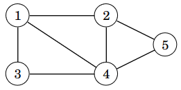
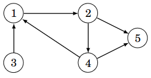
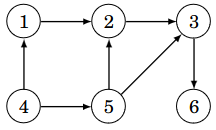
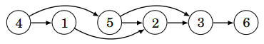
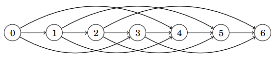
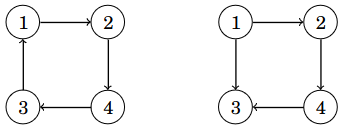
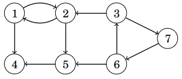
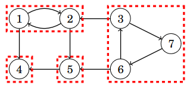
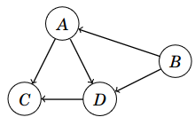

# 13. Suunnatut verkot

Tähän mennessä olemme olettaneet, että verkon kaaria voi kulkea molempiin suuntiin eli verkko on _suuntaamaton_ (_undirected_). Esimerkiksi seuraava verkko on suuntaamaton:



Tässä luvussa tarkastelemme tilannetta, jossa verkko on _suunnattu_ (_directed_). Tällöin kaarissa on nuolet, jotka osoittavat, kumpaan suuntaan kaarta voi kulkea. Esimerkiksi seuraava verkko on suunnattu:



Suunnattuja verkkoja voi käsitellä melko samalla tavalla kuin suuntaamattomia, mutta kaarten suunnat muuttavat joitakin asioita. Tutustumme tässä luvussa algoritmeihin, jotka liittyvät erityisesti suunnattujen verkkojen käsittelyyn.

## Suunnatun verkon esittäminen

Suunnattu verkko voidaan esittää ohjelmoinnissa samaan tapaan vieruslistoina kuin suuntaamaton verkko, mutta kaaret lisätään verkkoon vain toiseen suuntaan. Seuraava luokka soveltuu suunnatun verkon esittämiseen:

```python
class Graph:
    def __init__(self, nodes):
        self.nodes = nodes
        self.graph = {node: [] for node in self.nodes}

    def add_edge(self, a, b):
        self.graph[a].append(b)
```

Koska verkko on suunnattu, metodi `add_edge` lisää solmun `a` vieruslistalle solmun `b`, mutta se ei lisää solmun `b` vieruslistalle solmua `a`. Vieruslista siis sisältää solmut, joihin pääsee kulkemalla kaarta haluttuun suuntaan.

Nyt äskeinen esimerkkiverkko voidaan luoda näin:

```python
g = Graph([1, 2, 3, 4, 5])

g.add_edge(1, 2)
g.add_edge(2, 4)
g.add_edge(2, 5)
g.add_edge(3, 1)
g.add_edge(4, 1)
g.add_edge(4, 5)
```

Suunnatun verkon käsittelyyn voidaan käyttää syvyyshakua ja leveyshakua samaan tapaan kuin suuntaamattoman verkon käsittelyyn. Koska kaaret on lisätty vain yhteen suuntaan, haut kulkevat verkossa kaarien suuntien mukaisesti.

## Topologinen järjestys

Suunnatun verkon _topologinen järjestys_ (_topological sort_) on solmujen järjestys, joka toteuttaa seuraavan ehdon: jos solmusta $$a$$ pääsee solmuun $$b$$, niin solmu $$a$$ on ennen solmua $$b$$ järjestyksessä.

Tarkastellaan esimerkkinä seuraavaa verkkoa:



Yksi mahdollinen topologinen järjestys tälle verkolle on $$[4,1,5,2,3,6]$$. Seuraavassa kuvassa verkon solmut on aseteltu topologiseen järjestykseen, jolloin kaikki kaaret kulkevat vasemmalta oikealle.



Topologinen järjestys on mahdollista muodostaa, kun verkossa ei ole _sykliä_ (_cycle_) eli verkko on _syklitön_ (_acyclic_). Sykli on verkossa oleva polku, joka palaa takaisin lähtösolmuun. Sykli estää topologisen järjestyksen muodostamisen, koska mikään syklin solmuista ei voi esiintyä ennen muita järjestyksessä.

Suunnatut syklittömät verkot ovat käteviä monissa sovelluksissa. Niistä käytetään joskus englanniksi termiä _dag_, joka tulee sanoista _directed acyclic graph_.

### Topologisen järjestyksen muodostaminen

Topologinen järjestys voidaan muodostaa suorittamalla verkossa syvyyshakuja. Verkon solmuilla on kolme mahdollista tilaa muodostamisen aikana:

* Tila 0: haku ei ole vielä käynyt solmussa
* Tila 1: solmun käsittely on aloitettu
* Tila 2: solmun käsittely on saatu loppuun

Algoritmin alussa jokaisen solmun tila on 0. Algoritmi käy läpi verkon solmut ja aloittaa syvyyshaun jokaisesta solmusta, jonka tila on 0. Kun haku saapuu solmuun, solmun tilaksi tulee 1. Kun haku on käynyt läpi kaikki solmusta lähtevät kaaret, solmun tilaksi tulee 2.

Algoritmi muodostaa listan, joka sisältää verkon solmut. Kukin solmu lisätään listalle siinä vaiheessa, kun solmun tilaksi tulee 2. Algoritmin päätteeksi tämä lista käännettynä ympäri on yksi verkon topologinen järjestys.

Jos verkossa on sykli, tämä havaitaan algoritmin aikana siitä, että haku päätyy kaarta pitkin solmuun, jonka tilana on 1. Tällöin verkossa on sykli eikä topologisen järjestyksen muodostaminen ole mahdollista.

Seuraavassa on algoritmin toteutus Pythonilla:

```python
class TopologicalSort:
    def __init__(self, nodes):
        self.nodes = nodes
        self.graph = {node: [] for node in self.nodes}

    def add_edge(self, a, b):
        self.graph[a].append(b)

    def visit(self, node):
        if self.state[node] == 1:
            self.cycle = True
            return
        if self.state[node] == 2:
            return

        self.state[node] = 1
        for next_node in self.graph[node]:
            self.visit(next_node)

        self.state[node] = 2
        self.order.append(node)

    def create(self):
        self.state = {}
        for node in self.nodes:
            self.state[node] = 0

        self.order = []
        self.cycle = False

        for node in self.nodes:
            if self.state[node] == 0:
                self.visit(node)

        if self.cycle:
            return None
        else:
            self.order.reverse()
            return self.order
```

Algoritmia voidaan käyttää näin:

```python
t = TopologicalSort([1, 2, 3, 4, 5, 6])

t.add_edge(1, 2)
t.add_edge(2, 3)
t.add_edge(3, 6)
t.add_edge(4, 1)
t.add_edge(4, 5)
t.add_edge(5, 2)
t.add_edge(5, 3)

print(t.create()) # [4, 5, 1, 2, 3, 6]
```

Huomaa, että algoritmin antama topologinen järjestys $$[4,5,1,2,3,6]$$ on eri kuin aiemmin esimerkkinä ollut topologinen järjestys $$[4,1,5,2,3,6]$$. Tämä johtuu siitä, että verkolla voi olla useita topologisia järjestyksiä ja algoritmi löytää yhden niistä.

### Miksi algoritmi toimii?

Algoritmin toiminnan voi perustella sillä, että kun verkossa on kaari solmusta $$a$$ solmuun $$b$$, solmun $$a$$ tilaksi tulee 2 myöhemmin kuin solmun $$b$$ tilaksi tulee 2. Niinpä algoritmi lisää solmun $$a$$ listaan myöhemmin kuin solmun $$b$$.

Tämän ansiosta kun lista käännetään lopuksi, solmu $$a$$ on topologisessa järjestyksessä ennen solmua $$b$$. Tämä takaa, että kaikki kaaret kulkevat vasemmalta oikealle topologisessa järjestyksessä.

Jos verkossa on sykli, haku päätyy jossain vaiheessa johonkin syklissä olevista solmuista ja kulkee kaaria eteenpäin niin, että se päätyy uudestaan samaan solmuun. Niinpä algoritmi onnistuu tunnistamaan tilanteen, jossa verkossa on sykli.

## Dynaaminen ohjelmointi

Suunnattujen syklittömien verkkojen käsittelyyn voidaan käyttää dynaamista ohjelmointia. Dynaamisella ohjelmoinnilla voidaan vastata esimerkiksi seuraaviin polkuihin liittyviin kysymyksiin:

* Montako erilaista polkua on solmusta $$a$$ solmuun $$b$$?
* Mikä on pienin määrä kaaria polulla solmusta $$a$$ solmuun $$b$$?
* Mikä on suurin määrä kaaria polulla solmusta $$a$$ solmuun $$b$$?

Kun verkossa ei ole syklejä, verkkoa voidaan käsitellä kätevästi dynaamisen ohjelmoinnin avulla. Tarkastellaan esimerkkinä polkujen määrän laskemista seuraavassa verkossa:


Tässä verkossa on $$3$$ erilaista polkua solmusta $$4$$ solmuun $$3$$:

* $$4 \rightarrow 1 \rightarrow 2 \rightarrow 3$$ <span></span>
* $$4 \rightarrow 5 \rightarrow 2 \rightarrow 3$$ <span></span>
* $$4 \rightarrow 5 \rightarrow 3$$ <span></span>

Kun halutaan laskea polut solmusta $$4$$ solmuun $$3$$, laskenta voidaan jakaa kahteen osaongelmaan:

* Polun ensimmäinen kaari on $$4 \rightarrow 1$$. Tässä tapauksessa lasketaan mukaan polut solmusta $$1$$ solmuun $$3$$.
* Polun ensimmäinen kaari on $$4 \rightarrow 5$$. Tässä tapauksessa lasketaan mukaan polut solmusta $$5$$ solmuun $$3$$.

Solmusta $$1$$ on $$1$$ polku solmuun $$3$$ ja solmusta $$5$$ on $$2$$ polkua solmuun $$3$$, joten polkuja solmusta $$4$$ solmuun $$3$$ on yhteensä $$1+2=3$$.

Yleisemmin kun halutaan laskea polkujen määrä solmusta $$x$$ solmuun $$y$$, voidaan käydä läpi kaikki solmut, joihin pääsee kaarella solmusta $$x$$. Kun lasketaan yhteen kaikissa näissä solmuissa polkujen määrät solmuun $$y$$, saadaan tuloksena polkujen määrä solmusta $$x$$ solmuun $$y$$. Koska verkossa ei ole syklejä, määrät voidaan laskea dynaamisella ohjelmoinnilla.

Seuraava koodi toteuttaa algoritmin Pythonilla:

```python
class CountPaths:
    def __init__(self, nodes):
        self.nodes = nodes
        self.graph = {node: [] for node in self.nodes}

    def add_edge(self, a, b):
        self.graph[a].append(b)

    def count_from(self, node):
        if node in self.result:
            return self.result[node]

        path_count = 0
        for next_node in self.graph[node]:
            path_count += self.count_from(next_node)

        self.result[node] = path_count
        return path_count

    def count_paths(self, x, y):
        self.result = {y: 1}
        return self.count_from(x)
```

Algoritmia voidaan käyttää näin:

```python
c = CountPaths([1, 2, 3, 4, 5, 6])

c.add_edge(1, 2)
c.add_edge(2, 3)
c.add_edge(3, 6)
c.add_edge(4, 1)
c.add_edge(4, 5)
c.add_edge(5, 2)
c.add_edge(5, 3)

print(c.count_paths(4, 3)) # 3
```

Tässä dynaaminen ohjelmointi on toteutettu tallentamalla sanakirjaan `result` jokaisesta solmusta polkujen määrä kohdesolmuun. Jos polkujen määrä on jo laskettu, sitä ei lasketa uudestaan, minkä ansiosta algoritmi toimii tehokkaasti.

### Ongelmien esittäminen verkkoina

Dynaaminen ohjelmointi voidaan yleensäkin nähdä suunnattujen syklittömien verkkojen käsittelynä. Tarkastellaan esimerkkinä seuraavaa tehtävää, joka ratkaistiin dynaamisella ohjelmoinnilla luvussa 10:

{: .note-title }
Tehtävä
<div class="note" markdown="1">

Käytössäsi on rajaton määrä kolikkoja, joiden arvot annetaan listassa. Montako eri tapaa on muodostaa kolikoista summa $$x$$?

Esimerkiksi kun kolikot ovat $$[1,3,4]$$ ja $$x=6$$, tapoja on $$9$$:

* $$[1,1,1,1,1,1]$$<span></span>
* $$[1,1,1,3]$$<span></span>
* $$[1,1,4]$$<span></span>
* $$[1,1,3,1]$$<span></span>
* $$[1,3,1,1]$$<span></span>
* $$[1,4,1]$$<span></span>
* $$[3,1,1,1]$$<span></span>
* $$[3,3]$$<span></span>
* $$[4,1,1]$$<span></span>


</div>

Tämä ongelma voidaan esittää verkkona, jossa jokainen solmu vastaa rahamäärää $$0,1,\dots,x$$ ja solmusta $$a$$ on kaari solmuun $$b$$, jos rahamäärästä $$a$$ pääsee yhdellä kolikolla rahamäärään $$b$$. Kun kolikot ovat $$[1,3,4]$$ ja $$x=6$$, verkko on seuraava:



Tässä verkossa jokainen polku solmusta $$0$$ solmuun $$x$$ tarkoittaa yhtä tapaa, miten rahamäärä voidaan muodostaa. Niinpä polkujen määrä solmusta $$0$$ solmuun $$x$$ on yhtä suuri kuin erilaisten tapojen määrä. Voisimme siis käyttää melkein suoraan äskeistä luokkaa `CountPaths` tehtävän ratkaisemiseen.

## Vahva yhtenäisyys

Suunnatussa verkossa yhtenäisyyden käsite on mutkikkaampi kuin suuntaamattomassa verkossa, koska kahden solmun välillä ei ole välttämättä polkua, vaikka solmut olisivat samassa komponentissa.

Esimerkiksi seuraavassa kuvassa vasemmassa verkossa on polku mistä tahansa solmusta mihin tahansa solmuun, mutta oikeassa verkossa ei ole esimerkiksi polkua solmusta $$2$$ solmuun $$1$$.



Suunnattu verkko on _vahvasti yhtenäinen_ (_strongly connected_), jos mistä tahansa solmusta on polku mihin tahansa solmuun. Äskeisessä kuvassa vasen verkko on vahvasti yhtenäinen, kun taas oikea verkko ei ole vahvasti yhtenäinen.

Suunnatun verkon _vahvasti yhtenäinen komponentti_ (_strongly connected component_) on maksimaalinen joukko solmuja, jossa mistä tahansa solmusta on polku mihin tahansa solmuun. Verkko voidaan jakaa aina vahvasti yhtenäisiin komponentteihin. Tarkastellaan esimerkkinä seuraavaa verkkoa:



Tässä tapauksessa vahvasti yhtenäiset komponentit ovat:



Seuraava kuva esittää vahvasti yhtenäiset komponentit verkkona, jossa jokainen solmu vastaa yhtä komponenttia:



Tässä komponentit ovat $$A=\{1,2\}$$, $$B=\{3,6,7\}$$, $$C=\{4\}$$ ja $$D=\{5\}$$.

Tällainen komponenteista muodostuva verkko on aina syklitön ja se tuo näkyviin verkon syvärakenteen eli miten verkossa pystyy liikkumaan solmuista toisiinsa.

### Kosarajun algoritmi

Verkon vahvasti yhtenäiset komponentit voidaan etsiä tehokkaasti Kosarajun algoritmilla. Algoritmi etsii komponentit kahdessa vaiheessa, joissa se käy läpi verkon solmut syvyyshaun avulla.

Algoritmin ensimmäinen vaihe luo listan solmuista samalla tavalla kuin topologisen järjestyksen muodostamisessa. Erona on kuitenkin, että algoritmi ei pidä muistissa solmujen tiloja eikä välitä verkossa mahdollisesti olevista sykleistä.

Algoritmin toinen vaihe suoritetaan _käänteisessä_ verkossa, jossa jokaisen kaaren suunta on käänteinen. Algoritmi käy läpi ensimmäisessä vaiheessa muodostetun solmujen listan käänteisessä järjestyksessä ja aloittaa haun jokaisesta solmusta, jota ei ole vielä käsitelty. Jokainen tällainen haku muodostaa yhden vahvasti yhtenäisen komponentin.

Algoritmi voidaan toteuttaa Pythonilla seuraavasti:

```python
class Kosaraju:
    def __init__(self, nodes):
        self.nodes = nodes
        self.graph = {node: [] for node in self.nodes}
        self.reverse = {node: [] for node in self.nodes}

    def add_edge(self, a, b):
        self.graph[a].append(b)
        self.reverse[b].append(a)

    def visit(self, node, phase):
        if node in self.visited:
            return
        self.visited.add(node)

        if phase == 1:
            graph = self.graph
        if phase == 2:
            graph = self.reverse

        for next_node in graph[node]:
            self.visit(next_node, phase)

        if phase == 1:
            self.order.append(node)

    def count_components(self):
        self.visited = set()
        self.order = []

        for node in self.nodes:
            self.visit(node, 1)

        self.order.reverse()
        self.visited.clear()

        count = 0
        for node in self.order:
            if node not in self.visited:
                count += 1
                self.visit(node, 2)

        return count
```

Algoritmia voidaan käyttää näin:

```python
k = Kosaraju([1, 2, 3, 4, 5, 6, 7])

k.add_edge(1, 2)
k.add_edge(1, 4)
k.add_edge(2, 1)
k.add_edge(2, 5)
k.add_edge(3, 2)
k.add_edge(3, 7)
k.add_edge(5, 4)
k.add_edge(6, 3)
k.add_edge(6, 5)
k.add_edge(7, 6)

print(k.count_components()) # 4
```

Tässä metodi `count_components` laskee vahvasti yhtenäisten komponenttien määrän. Esimerkkiverkossa metodi löytää $$4$$ vahvasti yhtenäistä komponenttia.

### Miksi algoritmi toimii?

Kosarajun algoritmin toisessa vaiheessa syvyyshaku lisää vahvasti yhtenäiseen komponenttiin kaikki solmut, joihin pääsee alkusolmusta ja joita ei ole vielä lisätty toiseen komponenttiin. Miten on varmaa, että tuloksena on vahvasti yhtenäinen komponentti eikä siihen tule ylimääräisiä solmuja?

Tarkastellaan jotain alkuperäisen verkon kaarta $$a \rightarrow b$$, joka johtaa vahvasti yhtenäisestä komponentista toiseen. Solmun $$b$$ komponentin solmut lisätään listalle ennen solmun $$a$$ komponentin solmuja, joten käänteisessä verkossa solmun $$a$$ komponentin solmut ovat ennen solmun $$b$$ komponentin solmuja. Algoritmin toisessa vaiheessa solmun $$a$$ komponentti muodostetaan ensin. Koska kaaret on käännetty, kaaresta $$a \rightarrow b$$ on tullut kaari $$b \rightarrow a$$, minkä ansiosta solmun $$a$$ komponentista ei ajauduta solmun $$b$$ komponenttiin.

Koska yllä oleva päättely toimii kaikissa kaarissa, jotka johtavat komponentista toiseen, algoritmi muodostaa komponentit oikein eikä niihin tule ylimääräisiä solmuja.
