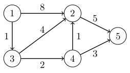

# 14. Lyhimmät polut

Tässä luvussa tarkastelemme lyhimpien polkujen etsimistä verkossa, joka on _painotettu_ (_weighted_) eli jokaisella kaarella on paino. Tällaisessa verkossa polun pituus on summa polulla olevien kaarten painoista.

Seuraavassa kuvassa on esimerkki painotetusta verkosta:



Jokaisen kaaren yhteydessä on ilmoitettu kaaren paino. Tässä verkossa esimerkiksi polun $$1 \rightarrow 3 \rightarrow 2$$ pituus on $$1+4=5$$, koska kaaren $$1 \rightarrow 3$$ paino on $$1$$ ja kaaren $$3 \rightarrow 2$$ paino on $$4$$.

Olemme käyttäneet aiemmin leveyshakua verkon lyhimpien polkujen etsimiseen, mutta algoritmi ei sovellu käytettäväksi painotetuissa verkoissa. Tässä luvussa tutustumme kolmeen algoritmiin, joilla voidaan etsiä lyhimpiä polkuja painotetuissa verkoissa.

## Bellman-Ford-algoritmi

Bellman-Ford-algoritmi laskee, mikä on etäisyys (eli lyhimmän polun pituus) annetusta alkusolmusta kuhunkin verkon solmuun. Algoritmi pitää yllä kullekin solmulle arviota solmun etäisyydestä. Alussa alkusolmun etäisyys on $$0$$ ja jokaisen muun solmun etäisyys on $$\infty$$.

Algoritmi muodostuu $$n-1$$ kierroksesta, missä $$n$$ on verkon solmujen määrä. Jokaisella kierroksella algoritmi käy läpi kaikki verkon kaaret ja koettaa pienentää etäisyyksiä kaarten avulla. Kun algoritmi käsittelee kaaren $$a \rightarrow b$$, se tarkastaa, saadaanko kaaren avulla pienempi etäisyys solmun $$a$$ kautta solmuun $$b$$. Jos etäisyys on pienempi, algoritmi merkitsee muistiin uuden etäisyyden.

Algoritmin suorituksen jälkeen etäisyydet ovat lopullisia ja ne vastaavat lyhimpien polkujen pituuksia alkusolmusta verkon solmuihin.

Bellman-Ford-algoritmi voidaan toteuttaa seuraavasti:

```python
class BellmanFord:
    def __init__(self, nodes):
        self.nodes = nodes
        self.edges = []

    def add_edge(self, node_a, node_b, weight):
        self.edges.append((node_a, node_b, weight))

    def find_distances(self, start_node):
        distances = {}
        for node in self.nodes:
            distances[node] = float("inf")
        distances[start_node] = 0

        num_rounds = len(self.nodes) - 1
        for _ in range(num_rounds):
            for edge in self.edges:
                node_a, node_b, weight = edge
                new_distance = distances[node_a] + weight
                if new_distance < distances[node_b]:
                    distances[node_b] = new_distance

        return distances
```

Lista `nodes` sisältää verkon solmut, ja lista `edges` sisältää verkon kaaret. Sanakirja `distances` sisältää etäisyydet alkusolmusta verkon solmuihin. Joka kierroksella algoritmi käy läpi listan `edges` ja koettaa pienentää etäisyyksiä kaarten avulla. Jos uusi etäisyys on pienempi kuin vanha etäisyys, algoritmi päivittää sen sanakirjaan `distances`.

Seuraava koodi etsii algoritmin avulla etäisyydet solmusta $$1$$ alkaen:

```python
b = BellmanFord([1, 2, 3, 4, 5])

b.add_edge(1, 2, 8)
b.add_edge(1, 3, 1)
b.add_edge(2, 5, 5)
b.add_edge(3, 2, 4)
b.add_edge(3, 4, 2)
b.add_edge(4, 2, 1)
b.add_edge(4, 5, 3)

distances = b.find_distances(1)
print(distances) # {1: 0, 2: 4, 3: 1, 4: 3, 5: 6}
```

Tässä tapauksessa etäisyydet ja niitä vastaavat polut ovat:

Kohdesolmu | Etäisyys | Polku
== | == | ==
$$1$$ | $$0$$ | $$1$$
$$2$$ | $$4$$ | $$1 \rightarrow 3 \rightarrow 4 \rightarrow 2$$
$$3$$ | $$1$$ | $$1 \rightarrow 3$$
$$4$$ | $$3$$ | $$1 \rightarrow 3 \rightarrow 4$$
$$5$$ | $$6$$ | $$1 \rightarrow 3 \rightarrow 4 \rightarrow 5$$

### Algoritmin tutkiminen

Algoritmin toiminnasta saa paremman kuvan lisäämällä siihen tulostuksen aina, kun algoritmi muuttaa etäisyyttä:

```python
                if new_distance < distances[node_b]:
                    print("update", node_a, node_b, new_distance)
                    distances[node_b] = new_distance
```

Tämän jälkeen algoritmin tulostus äskeisessä verkossa on seuraava:

```python
update 1 2 8
update 1 3 1
update 2 5 13
update 3 2 5
update 3 4 3
update 4 2 4
update 4 5 6
```

Tässä jokainen rivi näyttää yhden algoritmin tekemän muutoksen etäisyyksiin. Ensimmäinen muutos on, että solmun $$2$$ etäisyydeksi tulee $$8$$. Tässä käytetään kaarta $$1 \rightarrow 2$$, jonka paino on $$8$$. Koska etäisyys solmuun $$1$$ on $$0$$, tämän kaaren avulla saadaan uusi etäisyys $$8$$, joka korvaa vanhan etäisyyden $$\infty$$.

Yllä oleva tulostus näyttää myös, miten etäisyys solmuun voi muuttua useita kertoja algoritmin aikana. Esimerkiksi etäisyys solmuun $$2$$ on ensin $$\infty$$, sitten $$8$$ kaaren $$1 \rightarrow 2$$ kautta, sitten $$5$$ kaaren $$3 \rightarrow 2$$ kautta ja lopulta $$4$$ kaaren $$4 \rightarrow 2$$ kautta.

### Algoritmin analyysi

Bellman-Ford-algoritmi on löytänyt ensimmäisen kierroksen jälkeen kaikki lyhimmät polut, joissa on yksi kaari. Toisen kierroksen jälkeen se on löytänyt kaikki lyhimmät polut, joissa on enintään kaksi kaarta. Yleisemmin $$k$$ kierroksen jälkeen algoritmi on löytänyt kaikki lyhimmät polut, joissa on enintään $$k$$ kaarta.

Kun verkossa on $$n$$ solmua, jokaisessa lyhimmässä polussa on enintään $$n-1$$ kaarta. Tämä johtuu siitä, että jos polussa olisi $$n$$ tai enemmän kaaria, polku kävisi monta kertaa samassa solmussa. Tällainen polku ei kuitenkaan voisi olla lyhin polku, koska ei olisi järkevää käydä samassa solmussa useita kertoja. Niinpä Bellman-Fordin algoritmi on löytänyt $$n-1$$ kierroksen jälkeen lyhimmän polun jokaiseen verkon solmuun.

Koska algoritmi suorittaa $$n-1$$ kierrosta ja käy läpi jokaisella kierroksella $$m$$ kaarta, algoritmin aikavaativuus on $$O(nm)$$.

### Negatiiviset syklit

Bellman-Ford-algoritmi ei anna mielekästä tulosta, jos verkossa on negatiivinen sykli. Negatiivinen sykli tarkoittaa sykliä, jossa kaarten yhteispaino on negatiivinen. Tällaista sykliä kulkemalla polkuja voi lyhentää loputtomasti, jolloin lyhimmän polun käsite ei ole hyvin määritelty.

Seuraavassa on esimerkki tilanteesta, jossa verkossa on negatiivinen sykli:

```python
b = BellmanFord([1, 2, 3, 4])

b.add_edge(1, 2, 1)
b.add_edge(2, 3, 1)
b.add_edge(3, 2, -2)
b.add_edge(2, 4, 1)

distances = b.find_distances(1)
print(distances) # {1: 0, 2: -2, 3: 0, 4: -1}
```

Verkossa on kaari $$2 \rightarrow 3$$ painolla $$1$$ sekä kaari $$3 \rightarrow 2$$ painolla $$-2$$. Kun kuljetaan näitä kaaria edestakaisin, polun pituus vähenee aina $$1$$:llä. Tämän takia polun pituus solmusta $$1$$ mihin tahansa muuhun solmuun saadaan miten pieneksi tahansa eikä algoritmi anna mielekästä tulosta.

Bellman-Ford-algoritmin avulla voidaan kuitenkin havaita verkossa oleva negatiivinen sykli. Tämä voidaan tehdä suorittamalla algoritmia $$n$$ kierrosta tavallisen $$n-1$$ kierroksen sijasta. Jos verkossa on negatiivinen sykli, johon pääsee alkusolmusta, tämän huomaa siitä, että jokin etäisyys muuttuu vielä viimeisellä kierroksella.

## Dijkstran algoritmi

Dijkstran algoritmi etsii Bellman-Ford-algoritmin tavoin lyhimmät polut alkusolmusta kaikkiin muihin solmuihin. Dijkstran algoritmin etuna on, että se on selvästi Bellman-Ford-algoritmia tehokkaampi suurilla verkoilla. Algoritmia voidaan käyttää kuitenkin vain silloin, kun verkossa ei ole negatiivisen painoisia kaaria.

Dijkstran algoritmin lähtökohta on sama kuin Bellman-Ford-algoritmilla: jokaisella solmulla on muistissa etäisyys niin, että lähtösolmun etäisyys on $$0$$ ja kaikkien muiden solmujen etäisyys on $$\infty$$. Tämän jälkeen algoritmi pienentää etäisyyksiä, kunnes jokaisen solmun pienin etäisyys on löytynyt.

Algoritmi ottaa joka vaiheessa käsittelyyn solmun, jossa se ei ole vielä käynyt ja jonka etäisyys on mahdollisimman pieni. Tässä tilanteessa algoritmi on löytänyt kyseisen solmun pienimmän etäisyyden eikä etäisyys enää muutu. Algoritmi käy läpi solmusta lähtevät kaaret ja pienentää niiden avulla etäisyyksiä muihin solmuihin. Tämän jälkeen algoritmi merkitsee solmun käydyksi eikä palaa siihen enää uudestaan.

Kun algoritmi on käynyt läpi kaikki verkon solmut, jokaisen solmun etäisyys vastaa lyhimmän polun pituutta alkusolmusta kyseiseen solmuun.

Dijkstran algoritmi voidaan toteuttaa seuraavasti:

```python
import heapq

class Dijkstra:
    def __init__(self, nodes):
        self.nodes = nodes
        self.graph = {node: [] for node in nodes}

    def add_edge(self, node_a, node_b, weight):
        self.graph[node_a].append((node_b, weight))

    def find_distances(self, start_node):
        distances = {}
        for node in self.nodes:
            distances[node] = float("inf")
        distances[start_node] = 0

        queue = []
        heapq.heappush(queue, (0, start_node))

        visited = set()
        while queue:
            node_a = heapq.heappop(queue)[1]
            if node_a in visited:
                continue
            visited.add(node_a)

            for node_b, weight in self.graph[node_a]:
                new_distance = distances[node_a] + weight
                if new_distance < distances[node_b]:
                    distances[node_b] = new_distance
                    new_pair = (new_distance, node_b)
                    heapq.heappush(queue, new_pair)

        return distances
```

Verkko on tallennettu vieruslistoina niin, että jokainen vieruslistan alkio on pari, jossa on kaaren kohdesolmu ja paino. Algoritmi muodostaa sanakirjan `distances` samaan tapaan kuin Bellman-Ford-algoritmi.

Koska algoritmin tulee ottaa käsittelyyn solmu, jonka etäisyys on pienin, algoritmissa on käytössä keko `queue`, jonka avulla haluttu solmu voidaan löytää tehokkaasti. Keon jokainen alkio on pari, jossa on solmun etäisyys ja solmun tunnus. Algoritmi ottaa keosta käsittelyyn solmun, jonka etäisyys on pienin. Jos algoritmi ei ole vielä käynyt solmussa, se päivittää etäisyyksiä ja lisää päivitetyt solmut kekoon.

Huomaa, että sama solmu saattaa esiintyä keossa useita kertoja eri etäisyyksillä. Tämä ei kuitenkaan haittaa, koska algoritmi käsittelee solmun vain silloin, kun se valitaan ensimmäisen kerran keosta.

Algoritmia voidaan käyttää näin:

```python
d = Dijkstra([1, 2, 3, 4, 5])

d.add_edge(1, 2, 8)
d.add_edge(1, 3, 1)
d.add_edge(2, 5, 5)
d.add_edge(3, 2, 4)
d.add_edge(3, 4, 2)
d.add_edge(4, 2, 1)
d.add_edge(4, 5, 3)

distances = d.find_distances(1)
print(distances) # {1: 0, 2: 4, 3: 1, 4: 3, 5: 6}
```

### Algoritmin analyysi

Dijkstran algoritmi ottaa joka vaiheessa käsittelyyn solmun, jonka etäisyys on mahdollisimman pieni. Tämän jälkeen solmun etäisyys ei enää muutu, koska algoritmi käsittelee jokaisen solmun vain kerran.

Algoritmin toiminta perustuu oletukseen, ettei verkossa ole negatiivisia kaaria. Tällöin pienimmän etäisyyden solmu on turvallinen valinta, koska solmuun ei voi olla lyhempää polkua jonkin toisen vielä käsittelemättömän solmun kautta. Jos tällainen polku olisi, toisen solmun etäisyyden tulisi olla pienempi kuin käsiteltävän solmun etäisyyden, mikä ei ole mahdollista.

Algoritmin aikavaativuus on $$O(n + m \log m)$$. Aikavaativuus $$O(n)$$ tulee siitä, että algoritmi käy läpi verkon solmut. Aikavaativuus $$O(m \log m)$$ puolestaan tulee siitä, että algoritmi laittaa kutakin kaarta kohden enintään yhden alkion kekoon ja poistaa alkion myöhemmin keosta.

### Negatiiviset kaaret

Seuraava koodi havainnollistaa, miksi Dijkstran algoritmi ei välttämättä anna oikeaa tulosta, jos verkossa on negatiivinen kaari:

```python
d = Dijkstra([1, 2, 3, 4])

d.add_edge(1, 2, 3)
d.add_edge(2, 3, -4)
d.add_edge(1, 3, 1)
d.add_edge(3, 4, 1)

distances = d.find_distances(1)
print(distances) # [0, 3, -1, 2]
```

Tässä lyhin polku solmusta $$1$$ solmuun $$4$$ on $$1 \rightarrow 2 \rightarrow 3 \rightarrow 4$$, jonka pituus on $$3-4+1=0$$. Kuitenkin Dijkstran algoritmi valitsee polun $$1 \rightarrow 3 \rightarrow 4$$, jonka pituus on $$2$$. Algoritmi antaa väärän tuloksen, koska jälkimmäinen polku näyttää lyhemmältä, kun katsotaan vain kaaria $$1 \rightarrow 2$$ ja $$1 \rightarrow 3$$. Algoritmi ei pysty ottamaan huomioon, että negatiivinen kaaren paino $$-4$$ lyhentää polkua.

## Lyhimmän polun muodostaminen

Tähän mennessä olemme käyttäneet Bellman-Ford-algoritmia ja Dijkstran algoritmia etäisyyksien laskemiseen. Algoritmeilla voi kuitenkin myös muodostaa lyhimmän polun alkusolmusta loppusolmuun. Tämän voi tehdä tallentamalla etäisyyden muuttuessa tiedon siitä, minkä kaaren avulla etäisyys muuttui. Tämän jälkeen lyhimmän polun pystyy muodostamaan kulkemalla polun käänteisesti.

Muutetaan esimerkkinä Bellman-Ford-algoritmin toteutusta niin, että se palauttaa etäisyyksien sijasta lyhimmän polun:

```python
    def shortest_path(self, start_node, end_node):
        distances = {}
        for node in self.nodes:
            distances[node] = float("inf")
        distances[start_node] = 0
        previous = {}
        previous[start_node] = None

        for _ in range(len(self.nodes) - 1):
            for edge in self.edges:
                node_a, node_b, weight = edge
                new_distance = distances[node_a] + weight
                if new_distance < distances[node_b]:
                    distances[node_b] = new_distance
                    previous[node_b] = node_a

        if distances[end_node] == float("inf"):
            return None

        path = []
        node = end_node
        while node:
            path.append(node)
            node = previous[node]

        path.reverse()
        return path
```

Metodi luo sanakirjan `previous`, johon tallennetaan jokaisesta solmusta edellinen solmu lyhimmällä polulla. Tämän sanakirjan avulla lyhin polku voidaan muodostaa käänteisesti algoritmin suorituksen jälkeen. Metodi muodostaa polun listaan `path` ja kääntää tämän listan ympäri ennen listan palauttamista.

Seuraava koodi esittelee metodin käyttämistä:

```python
b = BellmanFord([1, 2, 3, 4, 5])

b.add_edge(1, 2, 8)
b.add_edge(1, 3, 1)
b.add_edge(2, 5, 5)
b.add_edge(3, 2, 4)
b.add_edge(3, 4, 2)
b.add_edge(4, 2, 1)
b.add_edge(4, 5, 3)

path = b.shortest_path(1, 5)
print(path) # [1, 3, 4, 5]
```

Tässä metodi etsii lyhimmän polun solmusta $$1$$ solmuun $$5$$. Metodin tuloksena on polku $$[1,3,4,5]$$, jonka pituus on $$6$$.

Myös Dijkstran algoritmia voisi muuttaa vastaavalla tavalla niin, että se etsii lyhimmän polun alkusolmusta loppusolmuun.

## Floyd-Warshall-algoritmi

Floyd-Warshall-algoritmi etsii etäisyydet verkon kaikkien solmuparien välillä. Toisin kuin muut tämän luvun algoritmit, Floyd-Warshall-algoritmi etsii yhdellä kertaa etäisyydet kaikista solmuista alkaen eikä sille anneta alkusolmua. Algoritmia voidaan käyttää millä tahansa verkolla, kunhan verkossa ei ole negatiivista sykliä.

Algoritmi käsittelee verkkoa _vierusmatriisina_ (_adjacency matrix_), jossa rivin $$a$$ sarakkeessa $$b$$ ilmoitetaan kaaren pituus solmusta $$a$$ solmuun $$b$$. Jos $$a=b$$, pituus on $$0$$, ja jos verkossa ei ole kaarta solmusta $$a$$ solmuun $$b$$, pituus on $$\infty$$.

Tarkastellaan esimerkkinä seuraavaa verkkoa:


Tämän verkon sisältö voidaan esittää vierusmatriisina seuraavasti:

<span></span> | $$1$$ | $$2$$ | $$3$$ | $$4$$ | $$5$$
$$1$$ | $$0$$ | $$8$$ | $$1$$ | $$\infty$$ | $$\infty$$
$$2$$ | $$\infty$$ | $$0$$ | $$\infty$$ | $$\infty$$ | $$5$$
$$3$$ | $$\infty$$ | $$4$$ | $$0$$ | $$2$$ | $$\infty$$
$$4$$ | $$\infty$$ | $$1$$ | $$\infty$$ | $$0$$ | $$3$$
$$5$$ | $$\infty$$ | $$\infty$$ | $$\infty$$ | $$\infty$$ | $$0$$

Esimerkiksi rivin $$3$$ sarakkeessa $$2$$ on luku $$4$$, koska verkossa on solmusta $$3$$ solmuun $$2$$ kaari, jonka pituus on $$4$$.

Floyd-Warhall-algoritmi muodostaa etäisyysmatriisin, jossa rivin $$a$$ sarake $$b$$ ilmaisee lyhimmän polun pituuden solmusta $$a$$ solmuun $$b$$. Etäisyysmatriisin pohjana on verkon vierusmatriisi, joka sisältää niiden polkujen pituudet, joissa on enintään yksi kaari.

Algoritmi muodostuu kolmesta sisäkkäisestä silmukasta, joista jokainen käy läpi verkon solmut. Ensimmäinen silmukka valitsee välisolmun $$k$$ ja sisemmät silmukat käyvät läpi polkuja, joissa polun osana on solmu $$k$$. Jos polun pituus lyhenee kulkemalla solmun $$k$$ kautta, algoritmi merkitsee uuden pituuden muistiin.

Algoritmi voidaan toteuttaa seuraavasti:

```python
class FloydWarshall:
    def __init__(self, nodes):
        self.nodes = nodes
        self.graph = {}
        for a in self.nodes:
            for b in self.nodes:
                distance = 0 if a == b else float("inf")
                self.graph[(a, b)] = distance

    def add_edge(self, a, b, w):
        self.graph[(a, b)] = min(self.graph[(a, b)], w)

    def find_distances(self):
        distances = self.graph.copy()

        for k in self.nodes:
            for a in self.nodes:
                for b in self.nodes:
                    distance = min(distances[(a, b)],
                                   distances[(a, k)] +
                                   distances[(k, b)])
                    distances[(a, b)] = distance

        return distances
```

Sanakirja `graph` sisältää vierusmatriisin. Alussa etäisyys solmusta $$a$$ solmuun $$b$$ on $$0$$, jos $$a=b$$, ja muuten $$\infty$$. Kun verkkoon lisätään kaari, sanakirjaan merkitään kaaren paino. Jos sama kaari lisätään monta kertaa eri painoilla, sanakirjaan jää talteen pienin kyseisen kaaren paino.

Metodi `find_distances` muodostaa etäisyysmatriisin vierusmatriisin perusteella. Metodi muodostuu kolmesta sisäkkäisestä silmukasta, jotka käyvät läpi verkon solmut. Kun välisolmu on $$k$$, algoritmi käy läpi tilanteet, jossa polkua solmusta $$a$$ solmuun $$b$$ voidaan lyhentää kulkemalla solmun $$k$$ kautta.

Seuraava koodi testaa algoritmia:

```python
f = FloydWarshall([1, 2, 3, 4, 5])

f.add_edge(1, 2, 8)
f.add_edge(1, 3, 1)
f.add_edge(2, 5, 5)
f.add_edge(3, 2, 4)
f.add_edge(3, 4, 2)
f.add_edge(4, 2, 1)
f.add_edge(4, 5, 3)

distances = f.find_distances()

print(distances[(1, 4)]) # 3
print(distances[(2, 1)]) # inf
print(distances[(3, 5)]) # 5
```

Tämä tarkoittaa, että etäisyys solmusta $$1$$ solmuun $$4$$ on $$3$$, verkossa ei ole polkua solmusta $$2$$ solmuun $$1$$ ja etäisyys solmusta $$3$$ solmuun $$5$$ on $$5$$.

Tässä tapauksessa metodin `find_distances` palauttama etäisyysmatriisi on seuraava:

<span></span> | $$1$$ | $$2$$ | $$3$$ | $$4$$ | $$5$$
$$1$$ | $$0$$ | $$4$$ | $$1$$ | $$3$$ | $$6$$
$$2$$ | $$\infty$$ | $$0$$ | $$\infty$$ | $$\infty$$ | $$5$$
$$3$$ | $$\infty$$ | $$3$$ | $$0$$ | $$2$$ | $$5$$
$$4$$ | $$\infty$$ | $$1$$ | $$\infty$$ | $$0$$ | $$3$$
$$5$$ | $$\infty$$ | $$\infty$$ | $$\infty$$ | $$\infty$$ | $$0$$

### Algoritmin analyysi

Kun välisolmuna on $$k$$, algoritmi muodostaa lyhimmät polut, joissa polun osana on solmu $$k$$ ja kaikki muut välisolmut ovat solmuja väliltä $$1 \dots k-1$$. Koska $$k$$ on vuorollaan $$1,2,\dots,n$$, algoritmi saa laskettua lopulta kaikki solmujen etäisyydet verkossa.

Algoritmin aikavaativuus on $$O(n^3)$$, koska se muodostuu kolmesta sisäkkäisestä silmukasta, jotka käyvät läpi verkon solmut.

## Miten valita algoritmi?

Dijkstran algoritmi on usein hyvä valinta lyhimpien polkujen etsimiseen. Algoritmi on tehokas, ja sovelluksissa voidaan usein olettaa, että verkossa ei ole negatiivisia kaaria. Esimerkiksi jos kaarten painot kuvaavat teiden pituuksia tai yhteyksien hintoja, nämä arvot eivät yleensä voi olla negatiivisia.

Bellman-Ford-algoritmi toimii myös silloin, kun verkossa on negatiivisia kaaria, kunhan verkossa ei ole negatiivista sykliä. Algoritmin huonona puolena on, että se on hidas, jos verkko on suuri. Floyd-Warshall-algoritmi on kätevä silloin, kun halutaan laskea etäisyydet kaikkien solmujen välillä.
