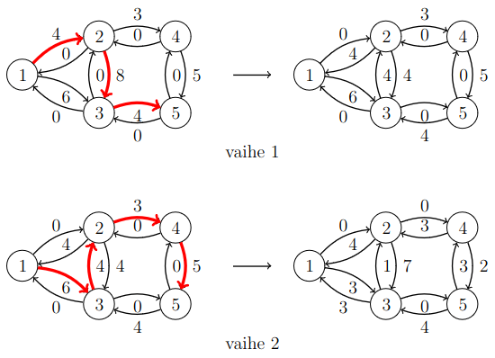

# 16. Maksimivirtaus

Tämän luvun tavoitteena on muodostaa suunnatussa verkossa _virtaus_ (_flow_) alkusolmusta (_source_) loppusolmuun (_sink_). Jokaisella verkon kaarella on _kapasiteetti_ (_capacity_), joka ilmaisee, paljonko virtausta kaaren kautta voi kulkea enintään.

Virtaus tulee muodostaa niin, että alkusolmusta lähtevä virtaus on yhtä suuri kuin loppusolmuun tuleva virtaus, ja kaikissa muissa solmuissa solmuun tuleva virtaus ja solmusta lähtevä virtaus on yhtä suuri. Kaikissa kaarissa virtauksen tulee olla enintään yhtä suuri kuin kaaren kapasiteetin.

Verkon _maksimivirtaus_ (_maximum flow_) on suurin mahdollinen virtaus. Seuraava kuva näyttää esimerkin maksimivirtauksesta solmusta $$1$$ solmuun $$5$$.


Tässä merkintä $$x/c$$ tarkoittaa, että kaaren kapasiteetti on $$c$$ ja siitä on käytetty $$x$$. Esimerkiksi kaaren $$1 \rightarrow 2$$ kapasiteetti on $$4$$ ja koko kapasiteetti on käytetty. Vastaavasti kaaren $$1 \rightarrow 3$$ kapasiteetti on $$6$$ ja siitä on käytetty $$3$$.

Tässä verkossa maksimivirtaus on $$7$$, joka on solmusta $$1$$ lähtevä virtaus ja solmuun $$5$$ tuleva virtaus. Kaikissa muissa solmuissa tuleva ja lähtevä virtaus on sama. Esimerkiksi solmussa $$2$$ tuleva virtaus ja lähtevä virtaus on $$4$$.

## Ford-Fulkerson-algoritmi

Tavallinen tapa muodostaa verkon maksimivirtaus on käyttää Ford-Fulkerson-algoritmia. Siinä verkko esitetään erityisessä muodossa, jossa jokaista kaarta kohden verkkoon lisätään toinen vastakkaiseen suuntaan kulkeva kaari, jonka kapasiteetti on alussa $$0$$. Esimerkkiverkossa alkutilanne on seuraava:


Algoritmi lisää verkkoon virtausta etsimällä polkuja alkusolmusta loppusolmuun. Tällaista polkua kutsutaan nimellä _täydennyspolku_ (_augmenting path_). Alussa virtaus on $$0$$, ja virtaus kasvaa algoritmin aikana.

Algoritmi etsii joka vaiheessa täydennyspolun, jossa jokaisen kaaren kapasiteetti on positiivinen. Tällainen polku lisää virtausta $$x$$:llä, missä $$x$$ on pienin kapasiteetti polulla. Tämän jälkeen algoritmi pienentää jokaisen polun kaaren kapasiteettia $$x$$:llä ja kasvattaa jokaisen vastakkaisen kaaren kapasiteettia $$x$$:llä.

Algoritmi muodostaa täydennyspolkuja ja lisää virtausta, kunnes polun muodostaminen ei ole enää mahdollista. Kun näin tapahtuu, algoritmi päättyy ja sen muodostama virtaus on verkon maksimivirtaus.

Esimerkkiverkossa maksimivirtaus voidaan muodostaa seuraavasti kahdessa vaiheessa:



Ensimmäisessä vaiheessa algoritmi muodostaa täydennyspolun $$1 \rightarrow 2 \rightarrow 3 \rightarrow 5$$. Pienin kapasiteetti polulla on $$4$$, joten polku lisää virtausta $$4$$:llä. Jokaisen polun kaaren kapasiteetti pienenee $$4$$:llä ja jokaisen vastakkaisen kaaren kapasiteetti kasvaa $$4$$:llä.

Toisessa vaiheessa algoritmi muodostaa täydennyspolun $$1 \rightarrow 3 \rightarrow 2 \rightarrow 4 \rightarrow 5$$. Pienin kapasiteetti tällä polulla on $$3$$, joten polku lisää virtausta $$3$$:lla. Kaarten kapasiteetit muuttuvat vastaavasti kuin ensimmäisessä vaiheessa.

Huomaa, että toisessa vaiheessa polku kulkee kaarta $$3 \rightarrow 2$$, joka on verkkoon lisätty vastakkainen kaari. Tätä kaarta on mahdollista kulkea, koska kaareen tuli kapasiteettia ensimmäisessä vaiheessa. Kulkemalla vastakkaisia kaaria algoritmi pystyy tällä tavalla peruuttamaan aiemmin muodostettua virtausta.

Näiden vaiheiden jälkeen verkossa ei ole mitään täydennyspolkua, jossa jokainen kapasiteetti olisi positiivinen. Tällöin algoritmi pysähtyy ja maksimivirtaus on löytynyt. Tässä tapauksessa maksimivirtaus on $$4+3=7$$.

### Algoritmin toteutus

Ford-Fulkerson-algoritmi voidaan toteuttaa seuraavasti:

```python
class MaximumFlow:
    def __init__(self, nodes):
        self.nodes = nodes
        self.graph = {}
        for i in self.nodes:
            for j in self.nodes:
                self.graph[(i, j)] = 0

    def add_edge(self, node_a, node_b, capacity):
        self.graph[(node_a, node_b)] += capacity

    def add_flow(self, node, sink, flow):
        if node in self.seen:
            return 0
        self.seen.add(node)
        if node == sink:
            return flow
        for next_node in self.nodes:
            if self.flow[(node, next_node)] > 0:
                new_flow = min(flow, self.flow[(node, next_node)])
                inc = self.add_flow(next_node, sink, new_flow)
                if inc > 0:
                    self.flow[(node, next_node)] -= inc
                    self.flow[(next_node, node)] += inc
                    return inc
        return 0

    def construct(self, source, sink):
        self.flow = self.graph.copy()
        total = 0
        while True:
            self.seen = set()
            add = self.add_flow(source, sink, float("inf"))
            if add == 0:
                break
            total += add
        return total
```

Tässä toteutuksessa kaarten kapasiteetit tallennetaan matriisiin, jossa on paikka jokaiselle mahdolliselle kaarelle verkossa. Tämän ansiosta verkkoon ei tarvitse lisätä erikseen vastakkaisia kaaria.

Metodi `construct` muodostaa maksimivirtauksen ja palauttaa sen suuruuden. Metodi `add_flow` suorittaa syvyyshaun, joka lisää virtausta. Metodi etsii täydennyspolun, jossa jokainen kapasiteetti on positiivinen. Polun löytymisen jälkeen metodi muuttaa kaarten kapasiteetteja. Metodin palautusarvo ilmaisee, paljonko virtaus kasvaa.

Algoritmia voidaan käyttää näin esimerkkiverkossa:

```python
m = MaximumFlow([1, 2, 3, 4, 5])

m.add_edge(1, 2, 4)
m.add_edge(1, 3, 6)
m.add_edge(2, 3, 8)
m.add_edge(2, 4, 3)
m.add_edge(3, 5, 4)
m.add_edge(4, 5, 5)

print(m.construct(1, 5)) # 7
```

## Minimileikkaus

Ford-Fulkerson-algoritmi on ahne algoritmi, koska se muodostaa täydennyspolkuja, kunnes polkua ei voi enää muodostaa. Miten voidaan tietää, että algoritmin tuloksena on maksimivirtaus?

Algoritmin toiminnan ymmärtämistä helpottaa tarkastella asiaa toisen ongelman kautta. Verkon _leikkaus_ (_cut_) tarkoittaa joukkoa kaaria, joiden poistaminen estää kulkemisen alkusolmusta loppusolmuun. Verkon _minimileikkaus_ (_minimum cut_) on puolestaan yhteispainoltaan pienin leikkaus.

Tässä on esimerkkiverkon minimileikkaus, joka estää kulkemisen alkusolmusta $$1$$ loppusolmuun $$5$$:


Tässä tapauksessa minimileikkaus sisältää kaaret $$2 \rightarrow 4$$ ja $$3 \rightarrow 5$$, joiden yhteispaino on $$3+4=7$$. Kun nämä kaaret poistetaan verkosta, siinä ei ole enää polkua alkusolmusta $$1$$ loppusolmuun $$5$$.

Esimerkkiverkon maksimivirtaus ja minimileikkaus ovat molemmat $$7$$, eikä tämä ole sattumaa: maksimivirtaus ja minimileikkaus ovat aina yhtä suuret. Ongelmat siis liittyvät toisiinsa, ja tämän avulla voidaan perustella, miksi Ford-Fulkerson-algoritmi toimii oikein.

Kun verkossa on mikä tahansa leikkaus, joka estää kulkemisen alkusolmusta loppusolmuun, tämä antaa ylärajan verkossa olevan virtauksen suuruudelle. Tämä johtuu siitä, että virtauksen täytyy edetä alkusolmun komponentista loppusolmun komponenttiin. Niinpä verkon virtaus on enintään yhtä suuri kuin verkon leikkaus.

Toisaalta voidaan näyttää, että maksimivirtaus vastaa verkossa olevaa leikkausta. Tämä voidaan havaita tarkastelemalla solmuja, joihin maksimivirtauksen muodostamisen jälkeen päästään alkusolmusta positiivisia kaaria. Esimerkkiverkossa nämä solmut ovat seuraavat:


Kun tarkastellaan näiden solmujen ulkopuolelle johtavia alkuperäisen verkon kaaria, näiden kaarten kapasiteettina täytyy olla $$0$$, koska kaaria ei voi enää kulkea. Niinpä kaarten kapasiteetti on käytetty kokonaan ja niiden yhteiskapasiteetti on yhtä suuri kuin verkon maksimivirtaus. Toisaalta kaaret muodostavat myös leikkauksen, koska ne jakavat verkon kahteen osaan.

Koska verkon virtaus on enintään yhtä suuri kuin verkon leikkaus ja tässä tapauksessa on löydetty virtaus, joka on yhtä suuri kuin leikkaus, tämä tarkoittaa, että kyseinen virtaus on maksimivirtaus ja kyseinen leikkaus on minimileikkaus.

## Esimerkki: Vankilapako

{: .note-title }
Tehtävä
<div class="note" markdown="1">

Kaupungissa on risteyksiä ja teitä, jotka yhdistävät risteyksiä. Kaupungissa on vankila ja satama, jotka sijaitsevat tietyissä risteyksissä.

Kaaleppi on paennut vankilasta ja pyrkii satamaan. Poliisi haluaa estää pakenemisen sulkemalla teitä niin, että ei ole mitään reittiä vankilasta satamaan. Mikä on pienin määrä teitä, jotka poliisin riittää sulkea?

</div>

Tämä tehtävä voidaan ratkaista muodostamalla verkko, jonka solmut ovat risteyksiä ja kaaret ovat teitä. Valitaan alkusolmuksi vankilan risteys, loppusolmuksi sataman risteys ja jokaisen kaaren painoksi $$1$$. Tämän verkon minimileikkaus ilmaisee, mitkä tiet poliisin tulee sulkea.

Tehtävää voisi myös laajentaa niin, että jokaisen tien sulkemisesta aiheutuu tietty haitta ja poliisi haluaa sulkea tiet niin, että yhteishaitta on mahdollisimman pieni. Tällöin haitan voisi esittää antamalla sen kaaren painoksi.

## Täydennyspolkujen valinta

Ford-Fulkerson-algoritmin tehokkuus riippuu siitä, millä tavalla täydennyspolut valitaan. Jokainen polku kasvattaa virtausta ainakin $$1$$:llä, minkä ansiosta algoritmi muodostaa enintään $$f$$ polkua, missä $$f$$ on verkon maksimivirtaus.

Yhden polun muodostaminen vie syvyyshaulla aikaa $$O(m)$$, missä $$m$$ on verkon kaarten määrä, joten algoritmille saadaan aikavaativuus $$O(mf)$$.

Joissakin tapauksissa jokainen polku saattaa todella kasvattaa virtausta $$1$$:llä, jolloin algoritmi joutuu muodostamaan suuren määrän polkuja. Tällainen tilanne on esimerkiksi seuraavassa verkossa:


Tässä kaaren kapasiteetti $$Z$$ on jokin suuri luku. Algoritmi voi päätyä muodostamaan vuorotellen polkuja $$1 \rightarrow 2 \rightarrow 3 \rightarrow 4$$ ja $$1 \rightarrow 3 \rightarrow 2 \rightarrow 4$$, jotka kääntävät solmujen $$2$$ ja $$3$$ välisen kaaren suuntaa. Jokainen polku lisää virtausta $$1$$:llä. Koska verkon maksimivirtaus on $$2Z$$, algoritmi muodostaa yhteensä $$2Z$$ polkua, mikä on hidasta.

Tehokkaampi algoritmi saadaan, kun algoritmi valitsee aina polun, jossa kaarten määrä on mahdollisimman pieni. Tämä voidaan toteuttaa etsimällä polku syvyyshaun sijasta leveyshaulla. Tuloksena oleva algoritmi tunnetaan nimellä Edmonds-Karp-algoritmi. Voidaan osoittaa, että tällöin algoritmi muodostaa enintään $$O(nm)$$ polkua ja algoritmin aikavaativuus on $$O(nm^2)$$.

Yllä olevassa verkossa Edmonds-Karp-algoritmi muodostaa vain kaksi kahden kaaren täydennyspolkua: esimerkiksi ensin $$1 \rightarrow 2 \rightarrow 4$$ ja sitten $$1 \rightarrow 3 \rightarrow 4$$. Molemmat polut lisäävät virtausta $$Z$$:llä, minkä jälkeen algoritmi päättyy.

## Maksimiparitus

Tarkastellaan suuntaamatonta verkkoa, joka on _kaksijakoinen_ (_bipartite_), mikä tarkoittaa, että verkon solmut voidaan jakaa kahteen ryhmään niin, että verkossa on kaaria vain ryhmästä toiseen mutta ei ryhmien sisäisesti.

Verkon _maksimiparitus_ (_maximum matching_) on suurin mahdollinen kaarten joukko, jossa pätee, että jokainen solmu kuuluu enintään yhteen kaareen. Seuraava kuva näyttää esimerkin kaksijakoisen verkon maksimiparituksesta:


Tässä solmut ovat jakautuneet kahteen ryhmään niin, että toinen ryhmä sisältää solmut $$\{1,2,3,4\}$$ ja toinen ryhmä sisältää solmut $$\{5,6,7\}$$. Verkon maksimiparitus sisältää $$3$$ kaarta, ja se voidaan muodostaa kaarista $$1-6$$, $$3-5$$ ja $$4-7$$.

Kaksijakoisen verkon maksimiparitus voidaan etsiä maksimivirtauksen avulla rakentamalla verkko seuraavasti:


Ideana on muuttaa kaksijakoinen verkko suunnatuksi ja lisätä siihen alkusolmu ja loppusolmu. Alkusolmusta on kaari jokaiseen vasemman ryhmän solmuun ja jokaisesta oikean ryhmän solmusta on kaari loppusolmuun. Lisäksi vasemman ryhmän solmusta on kaari oikean ryhmän solmuun, jos näiden solmujen välillä on kaari alkuperäisessä verkossa. Jokaisen kaaren painona on $$1$$.

Tämän verkon maksimivirtaus on yhtä suuri kuin alkuperäisen verkon maksimiparitus. Tämä johtuu siitä, että jokainen virtaukseen kuuluva polku kulkee jonkin alkuperäisen verkon kaaren kautta. Lisäksi kaarten painojen ansiosta jokainen solmu voi kuulua enintään yhteen polkuun.

## Esimerkki: Tanssiaiset

{: .note-title }
Tehtävä
<div class="note" markdown="1">

Tanssiaisiin osallistuu $$n$$ opiskelijaa Kumpulan kampukselta ja $$n$$ opiskelijaa Viikin kampukselta. Jokainen tanssipari muodostuu Kumpulan ja Viikin opiskelijasta.

Kukin opiskelija on toimittanut listan toisen kampuksen opiskelijoista, joiden kanssa hän suostuu tanssimaan. Tehtäväsi on etsiä mahdollisimman suuri määrä tanssipareja, joissa otetaan huomioon opiskelijoiden listat.

</div>

Tämä tehtävä voidaan ratkaista muodostamalla verkko, jossa jokaista opiskelijaa vastaa solmu ja kahden solmun välillä on kaari, jos opiskelijat ovat eri kampuksilta ja suostuvat tanssimaan toistensa kanssa. Tämä verkko on kaksijakoinen, koska kaksi saman kampuksen opiskelijaa ei voi muodostaa tanssiparia.

Koska verkko on kaksijakoinen, sen maksimiparitus eli suurin mahdollinen tanssiparien määrä voidaan löytää maksimivirtauksen avulla lisäämällä verkkoon alkusolmu ja loppusolmu sekä sopivat kaaret.
