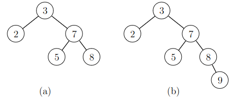
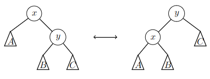
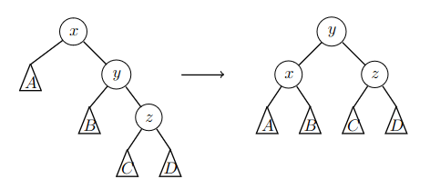
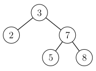
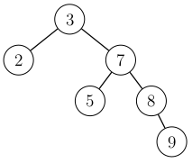
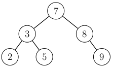
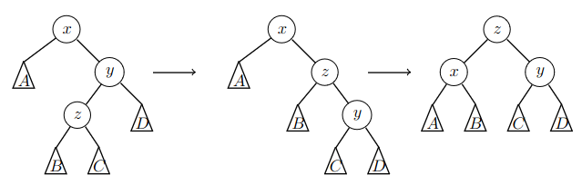
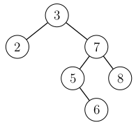
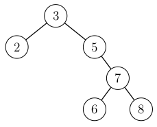
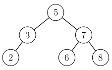

    
# AVL-puu

_AVL-puu_ (_AVL_ tree) on tasapainoinen binäärihakupuu, jonka korkeus on $$O(\log n)$$, kun puussa on $$n$$ solmua. Tämän ansiosta AVL-puuta käyttävässä joukossa operaatioiden aikavaativuus on $$O(\log n)$$.

## Tasapainoehto

AVL-puun tasapainoehtona on, että jokaisessa solmussa vasemman ja oikean alipuun korkeuksien ero saa olla enintään $$1$$.

Seuraavassa kuvassa vasemmassa puussa tasapainoehto on voimassa, mutta oikeassa puussa se ei ole voimassa, koska solmussa $$3$$ vasemman alipuun korkeus on $$0$$ ja oikean alipuun korkeus on $$2$$.

Tasapainoehdon hyötynä on, että sen ansiosta solmut jakautuvat tasaisesti eri puolille puuta ja puun korkeus on $$O(\log n)$$. Tämä voidaan perustella laskemalla, miten solmujen määrä vaikuttaa puun korkeuteen.

Olkoon $$f(h)$$ pienin mahdollinen solmujen määrä puussa, jonka korkeus on $$h$$. Funktion ensimmäiset arvot ovat $$f(0)=1$$ ja $$f(1)=2$$. Suuremmissa tapauksissa funktion arvo saadaan laskettua kaavalla

$$f(h) = f(h-2)+f(h-1)+1,$$

koska pienin korkeuden $$h$$ puu saadaan valitsemalla toiseksi alipuuksi pienin korkeuden $$h-2$$ puu ja toiseksi alipuuksi pienin korkeuden $$h-1$$ puu. Esimerkiksi $$f(2)=f(0)+f(1)+1=4$$ ja $$f(3)=f(1)+f(2)+1=7$$.

Tämän avulla voidaan arvioida, kuinka korkea enintään on puu, jossa on $$n$$ solmua. Tätä voidaan arvioida etsimällä suurin $$h$$, jossa $$f(h) \le n$$, koska jos puun korkeus on $$h$$, siinä tulee olla ainakin $$f(h)$$ solmua.

Kun $$h \ge 2$$, voimme arvioida funktion $$f(h)$$ arvoa näin:

$$f(h)=f(h-2)+f(h-1)+1 > 2 f(h-2)$$

Tämän perusteella $$f(h) > 2^{h/2}$$ eli suurin $$h$$, jolle $$f(h) \le n$$, on enintään $$2 \log_2(n)$$. Niinpä puun korkeus $$h$$ on luokkaa $$O(\log n)$$.

## Korkeudet ja kierrot

AVL-puu voidaan toteuttaa melko samalla tavalla kuin tavallinen binäärihakupuu. Erona on, että solmun lisäämisen ja poistamisen jälkeen tulee varmistaa, että tasapainoehto on edelleen voimassa.

Koska tasapainoehto liittyy alipuiden korkeuksiin, hyvä ratkaisu on tallentaa jokaiseen solmuun tieto siitä, miten korkea kyseinen alipuu on. Tämän avulla alipuun korkeus voidaan selvittää kätevästi aina tarvittaessa.

Jos puun tasapainoehto rikkoontuu, asia voidaan korjata tekemällä sopivanlaisia kiertoja puussa. AVL-puun kierrot ovat seuraavat:

Tässä $$x$$ ja $$y$$ ovat puun solmuja ja $$A$$, $$B$$ ja $$C$$ ovat alipuita. Kierto voidaan tehdä vasemmalta oikealle, jolloin $$y$$ nousee $$x$$:n yli, tai oikealta vasemmalle, jolloin $$x$$ nousee $$y$$:n yli. Näiden kiertojen avulla voidaan muuttaa alipuiden korkeuksia. Toisaalta kierrot säilyttävät solmut binäärihakupuun järjestyksessä.

## Alkion lisääminen

Kun puuhun lisätään alkio, lisäyksen jälkeen kuljetaan alhaalta ylös lisätystä solmusta puun juureen ja päivitetään reitillä olevien solmujen korkeudet. Jos korkeuden päivityksen jälkeen jossain solmussa vasemman ja oikean alipuun korkeuksien ero on yli $$1$$, puun rakennetta muutetaan kiertojen avulla.

Merkitään $$x$$:llä alinta solmua, jossa tasapainoehto ei ole voimassa, $$y$$:llä solmun $$x$$ lasta lisätyn solmun reitillä, sekä $$z$$:llä solmun $$y$$ lasta lisätyn solmun reitillä. Tässä on kaksi mahdollista tapausta:

### Tapaus 1

Solmut $$y$$ ja $$z$$ ovat samanpuoleisia lapsia. Tässä tapauksessa tehdään kierto, jolla solmu $$y$$ nostetaan ylimmäksi.

Esimerkiksi seuraavassa kuvassa solmut $$y$$ ja $$z$$ ovat oikeanpuoleisia lapsia. Tällöin solmun $$y$$ vasemmaksi lapseksi tulee $$x$$ ja oikeaksi lapseksi tulee $$z$$.

Jos solmut $$y$$ ja $$z$$ ovat vasemmanpuoleisia lapsia, sama kierto tehdään käänteisesti.

Tarkastellaan esimerkkinä seuraavaa puuta:

Kun puuhun lisätään alkio $$9$$, sen paikka valitaan ensin kuten tavallisesti binäärihakupuussa:

Lisäämisen jälkeen kuljetaan ylöspäin lisätystä solmusta juureen. Lisääminen rikkoi tasapainoehdon, koska juuressa vasemman alipuun korkeus on $$0$$ ja oikean alipuun korkeus on $$2$$. Tässä $$x=3$$, $$y=7$$ ja $$z=8$$.

Korjataan tilanne tekemällä kierto, jossa solmu $$7$$ nostetaan solmun $$3$$ yli:

Tämän kierron jälkeen puu on jälleen tasapainoinen.

### Tapaus 2

Solmut $$y$$ ja $$z$$ ovat eripuoleisia lapsia. Tällöin tehdään kaksi kiertoa: ensin solmu $$z$$ nostetaan solmun $$y$$ yli, ja sitten solmu $$z$$ nostetaan solmun $$x$$ yli.

Esimerkiksi seuraavassa kuvassa solmu $$y$$ on oikeanpuoleinen lapsi ja solmu $$z$$ on vasemmanpuoleinen lapsi. Tällöin solmun $$z$$ vasemmaksi lapseksi tulee $$x$$ ja oikeaksi lapseksi tulee $$y$$.

Jos solmut $$y$$ ja $$z$$ ovat eri päin, samat kierrot tehdään käänteisesti.

Tarkastellaan esimerkkinä seuraavaa puuta:

Kun puuhun lisätään alkio $$6$$, sen paikka valitaan ensin kuten tavallisesti binäärihakupuussa:

Lisäämisen jälkeen kuljetaan ylöspäin lisätystä solmusta juureen. Lisääminen rikkoi tasapainoehdon, koska juuressa vasemman alipuun korkeus on $$0$$ ja oikean alipuun korkeus on $$2$$. Tässä $$x=3$$, $$y=7$$ ja $$z=5$$.

Tehdään ensin kierto, jossa solmu $$5$$ nostetaan solmun $$7$$ yli:

Tehdään sitten kierto, jossa solmu $$5$$ nostetaan solmun $$3$$ yli:

Näiden kiertojen jälkeen puu on jälleen tasapainoinen.

### Aikavaativuus

Lisäyksen jälkeen kuljetaan reitti ylös juureen ja tehdään tarvittaessa kiertoja. Koska puun korkeus on $$O(\log n)$$ ja kierrot vievät aikaa $$O(1)$$, lisääminen vie aikaa $$O(\log n)$$. Voidaan osoittaa, että solmun lisääminen rikkoo tasapainoehdon enintään yhdessä solmussa, minkä ansiosta kiertoja täytyy tehdä enintään yhdessä puun kohdassa.

## Alkion poistaminen

Alkion poistaminen voidaan toteuttaa myös tehokkaasti $$O(\log n)$$-ajassa poistamalla alkio ensin tavallisen binäärihakupuun tapaan ja kulkemalla sitten ylös juureen ja korjaamalla tarvittaessa tasapainoehdot sopivilla kierroilla. Emme kuitenkaan käsittele alkion poistamista tarkemmin tällä kurssilla.
